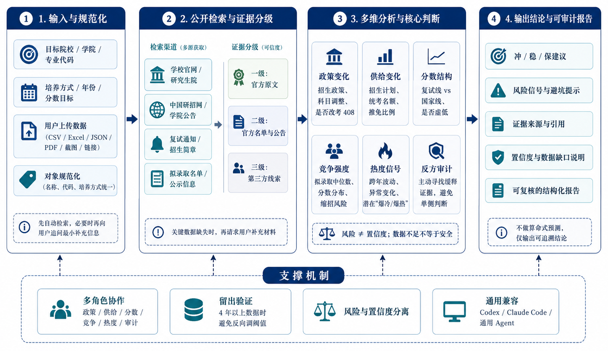

<p>
  
</p>

# 考研择校指南 Skill | 基于历年招生数据的择校助手


一个面向 **Codex、Claude Code 和通用 AI Agent** 的中国考研择校导航 Skill。输入目标学校、学院和专业后，Agent 会先从学校官网、研究生院、研招网和公开名单中寻找历年数据；只有关键数据确实找不到时，才向用户索取 CSV、Excel、JSON、PDF、截图或链接。

> 不做“算命式预测”。本项目输出的是可审计的风险信号、证据质量和置信度。

<p align="center">
  
</p>

<p>
  
  
  
  
  
</p>

<p>
  
  
  
  
  
</p>

这个 Skill 是一个面向考研择校的工程交付。它先从学校研究生院、招生网、学院公告和拟录取公示里找历年数据；
只有关键字段确实找不到时，才请用户上传 CSV、PDF、截图或链接。输出里会保留来源、口径、缺失项、置信度与冲稳保建议。

它的重点不是简单堆数字，而是把“找数据”变成：

> 输入学校 / 学院 / 专业代码 / 入学年份 → 公开检索 → 证据分级 → 数据校验 → 冲稳保建议


## 3 步上手

1. 先准备一个目标对象：学校、学院、专业代码、专业名称、培养方式、入学年份。
2. 如果你已经有历年数据，先按 [examples/sample.csv](examples/sample.csv) 的格式整理，再运行：

```bash
python3 scripts/validate_data.py examples/sample.csv
```

3. 如果你还没有数据，先让脚本生成检索计划：

```bash
python3 scripts/research_plan.py \
  --school "XX大学" \
  --college "XX学院" \
  --major-code "085404" \
  --major-name "计算机技术" \
  --year 2027
```

## 数据怎么来

### A. 你有 CSV / JSON

- 一行表示一个“年份 + 同口径专业”。
- 先校验，再分析。
- 推荐字段见 [references/data-schema.md](references/data-schema.md)。

### B. 你有 PDF / 截图 / 网页链接

- 先抽取文本或表格。
- 再把每一年的数据整理成一行。
- 仍然缺失的字段，保留为空，不要猜。

### C. 你什么都没有

- 先按公开来源顺序全网找。
- 优先学校研究生院、招生网、学院官网、官方 PDF 和公示。
- 找不到关键字段时，再只问你最小必要的补充材料。

具体流程见 [references/data-acquisition-flow.md](references/data-acquisition-flow.md)。

## 这个 Skill 会做什么

- 规范化研究对象，避免学院、代码、培养方式混用。
- 先找 `Y-3` 到 `Y-1` 的历年数据，再判断趋势。
- 记录来源等级、URL、发布日期和访问日期。
- 给出证据质量、缺失项、风险和置信度。
- 对“爆热 / 缩招 / 推免挤压 / 复试线虚低 / 改考”做分项审计。

## 仓库结构

```text
kaoyan-navigator-skill/
├── SKILL.md
├── agents/openai.yaml
├── examples/sample.csv
├── promotion/assets/
├── references/
│   ├── data-acquisition-flow.md
│   ├── data-schema.md
│   ├── decision-model.md
│   ├── report-template.md
│   └── research-playbook.md
└── scripts/
    ├── research_plan.py
    └── validate_data.py
```

## 让 Codex 直接识别这个 Skill

把整个仓库复制到本机技能目录：

```bash
cp -R /path/to/kaoyan-navigator-skill ~/.codex/skills/kaoyan-navigator
```

或者在对话里直接使用：

```text
使用 $kaoyan-navigator，分析 2027 年入学的 XX 大学 XX 学院 085404 计算机技术。
先找 2024-2026 年的官方数据；如果拟录取名单找不到，就告诉我需要补什么。
```

## 免责声明

本项目仅用于信息整理和择校辅助。招生政策、名额和分数线可能变化，最终请以教育部、研招网和目标院校官方公告为准。
